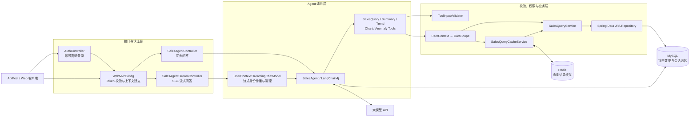
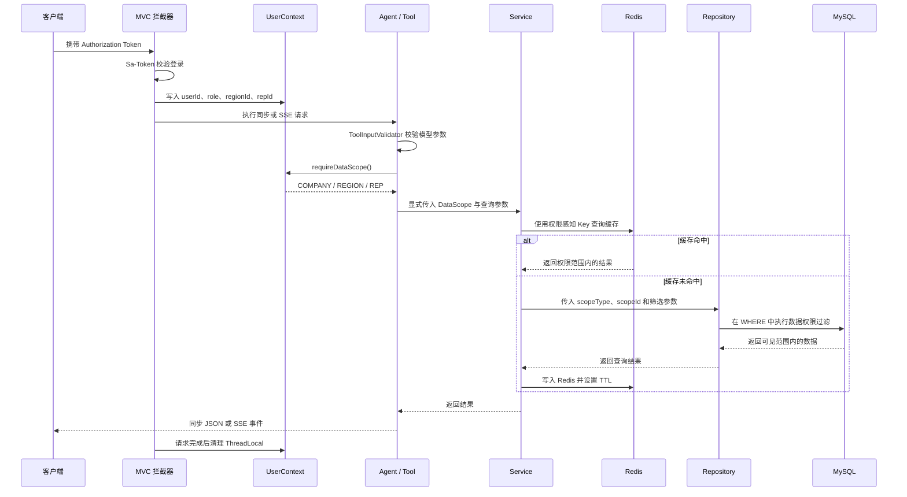
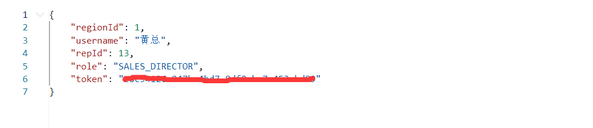
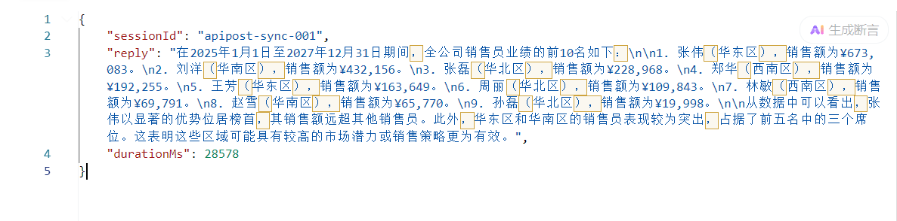
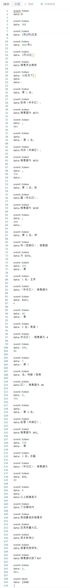
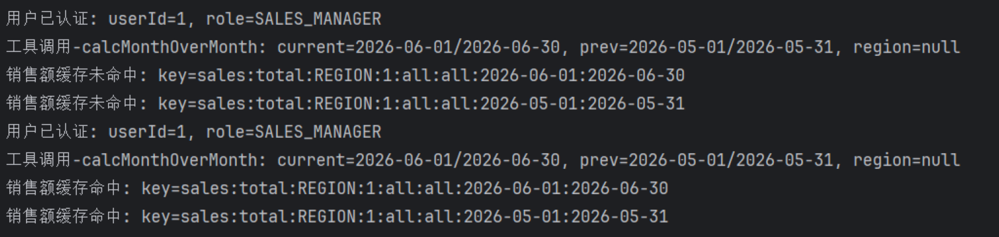

# 智能销售数据分析 Agent

基于 Spring Boot、LangChain4j、MySQL、Redis 和 Sa-Token 构建的销售数据分析 Agent。系统支持自然语言查询销售订单、业绩排名、趋势分析、图表数据生成和异常预警，并在同步与 SSE 流式调用中执行一致的数据权限隔离。

## 核心功能

- 账号密码登录：使用 BCrypt 校验密码，Sa-Token 管理登录状态。
- 自然语言分析：同步问答与 SSE 流式问答。
- Agent 工具：订单查询、销售汇总、趋势分析、图表生成、异常检测。
- 数据权限：总监查看全公司，主管查看本大区，销售员只查看本人。
- 参数校验：日期、日期范围、大区、TopN、月份、图表类型和统计维度等统一校验。
- Redis 缓存：支持手动查询缓存与 Spring Cache 声明式缓存。
- 权限缓存 Key：缓存 Key 显式包含 COMPANY、REGION 或 REP 数据范围。
- 对话记忆：Agent 会话记录持久化到 MySQL，并按登录用户与客户端 `sessionId` 隔离。
- 可观测性：记录工具调用、执行耗时和 Token 使用指标。
- 双 Agent 编排链路：保留 LangChain4j 生产链路，并提供 AgentScope Java 2.0.1 实验链路用于增量演进。

## 技术栈

| 分类 | 技术 |
|---|---|
| 开发语言 | Java 25 |
| Web 框架 | Spring Boot 3.5.11 |
| Agent 框架 | LangChain4j 1.12.1 / AgentScope Java 2.0.1 |
| 模型接口 | OpenAI 兼容接口 / DashScope |
| 数据库 | MySQL 8 |
| ORM | Spring Data JPA / Hibernate |
| 缓存 | Redis / Spring Cache |
| 认证 | Sa-Token / BCrypt |
| 流式输出 | SSE / Reactor Flux |
| 构建工具 | Maven |

## 系统架构



## 权限查询链路



## 数据权限模型

| 角色 | DataScope | 查询范围 |
|---|---|---|
| `SALES_DIRECTOR` | `COMPANY:0` | 全公司 |
| `SALES_MANAGER` | `REGION:{regionId}` | 本大区 |
| `SALES_REP` | `REP:{repId}` | 本人 |

权限范围会显式进入 Service、Repository 查询条件和 Redis Key。身份缺失或角色未知时直接拒绝查询，不会默认获得全公司权限。

## 项目结构

```text
src/main/java/com/dyh/salesAgent
├─ agent          Agent 接口和 LangChain4j 配置
├─ config         Web、Redis、密码编码和指标配置
├─ controller     登录、同步、SSE 和工具测试接口
├─ dto            查询结果与异常结果 DTO
├─ entity         JPA 实体
├─ memory         MySQL 对话记忆
├─ repository     数据库查询与权限条件
├─ security       UserContext、DataScope、参数校验和流式上下文
├─ service        查询服务与缓存服务
└─ tool           五类 Agent 工具
```

## 环境要求

- JDK 25
- Maven 3.9+
- MySQL 8
- Redis 7
- 可用的 DashScope API Key

## 环境变量

项目不会在配置文件中保存真实凭据。启动前设置以下环境变量：

| 环境变量 | 说明 | 示例 |
|---|---|---|
| `MYSQL_HOST` | MySQL 地址 | `localhost` |
| `MYSQL_PORT` | MySQL 端口 | `3306` |
| `MYSQL_DATABASE` | 数据库名称 | `sales_analysis_agent` |
| `MYSQL_USERNAME` | MySQL 用户名 | 请填写本机账号 |
| `MYSQL_PASSWORD` | MySQL 密码 | 请填写本机密码 |
| `REDIS_HOST` | Redis 地址 | `localhost` |
| `REDIS_PORT` | Redis 端口 | `6379` |
| `REDIS_PASSWORD` | Redis 密码 | 请填写本机密码 |
| `DASHSCOPE_API_KEY` | 模型 API Key | 请填写个人 Key |

PowerShell 示例：

```powershell
$env:MYSQL_USERNAME="YOUR_MYSQL_USERNAME"
$env:MYSQL_PASSWORD="YOUR_MYSQL_PASSWORD"
$env:REDIS_PASSWORD="YOUR_REDIS_PASSWORD"
$env:DASHSCOPE_API_KEY="YOUR_DASHSCOPE_API_KEY"
```

## 本地启动

1. 创建数据库：

```sql
CREATE DATABASE sales_analysis_agent
    DEFAULT CHARACTER SET utf8mb4
    COLLATE utf8mb4_unicode_ci;
```

2. 启动 MySQL 和 Redis。

3. 设置环境变量。

4. 编译并启动：

```bash
mvn clean package
mvn spring-boot:run
```

5. 查看健康状态：

```text
GET http://localhost:8087/actuator/health
```

## 接口测试

完整测试步骤和可导入 ApiPost 的 cURL 位于：

- [ApiPost 接口测试文档](docs/ApiPost接口测试.md)

## AgentScope Java 增量链路

AgentScope Java 采用并行接入方式，现有 `/agent/chat` 与 `/agent/chat/stream` 不变。新链路复用已有 12 个销售工具及其参数校验、Redis 缓存、数据权限和查询实现，避免在框架迁移阶段复制业务逻辑。

| 接口 | 用途 |
|---|---|
| `POST /agentscope/chat` | AgentScope ReActAgent 同步问答 |
| `POST /agentscope/chat/stream` | AgentScope 事件流，包含 `agent_start`、`model_start`、`model_end`、`token`、`tool_start`、`tool_end`、`summary`、`done` |
| `DELETE /agentscope/session/{sessionId}` | 清理当前用户的 AgentScope 会话状态 |

请求体与旧接口保持一致：

```json
{
  "sessionId": "agentscope-demo-001",
  "message": "统计今年各大区销售额并生成柱状图"
}
```

AgentScope 使用 DashScope 原生模型扩展，并通过 MySQL `AgentStateStore` 保存状态；首次启动时默认自动初始化所需表。相关参数位于 `sales-agent.agentscope`，仍复用 `DASHSCOPE_API_KEY`。该链路目前定位为技术栈验证入口，后续可在对比工具调用稳定性、流式事件和会话恢复效果后，再逐步决定是否迁移默认入口。

第二次增量通过 AgentScope 2.0 `MiddlewareBase` 采集 Agent、Reasoning、Model 和 Tool 四层执行数据。同步接口的 `execution` 字段以及流式接口的 `summary` 事件会返回请求 ID、耗时、推理轮次、模型/工具调用次数、工具名称和 Token 用量。指标通过现有 Actuator 暴露，名称以 `agentscope.*` 开头；用户问题、工具参数和查询结果不会写入指标或执行摘要。

## 演示截图

以下截图来自本地 ApiPost 与运行日志演示；发布前请确认截图中没有 Token、密码或 API Key。

### 登录成功



### 同步 Agent 回答



### SSE 流式回答



### Redis 未命中与命中




## 相关文档

- [ApiPost 接口测试](docs/ApiPost接口测试.md)
