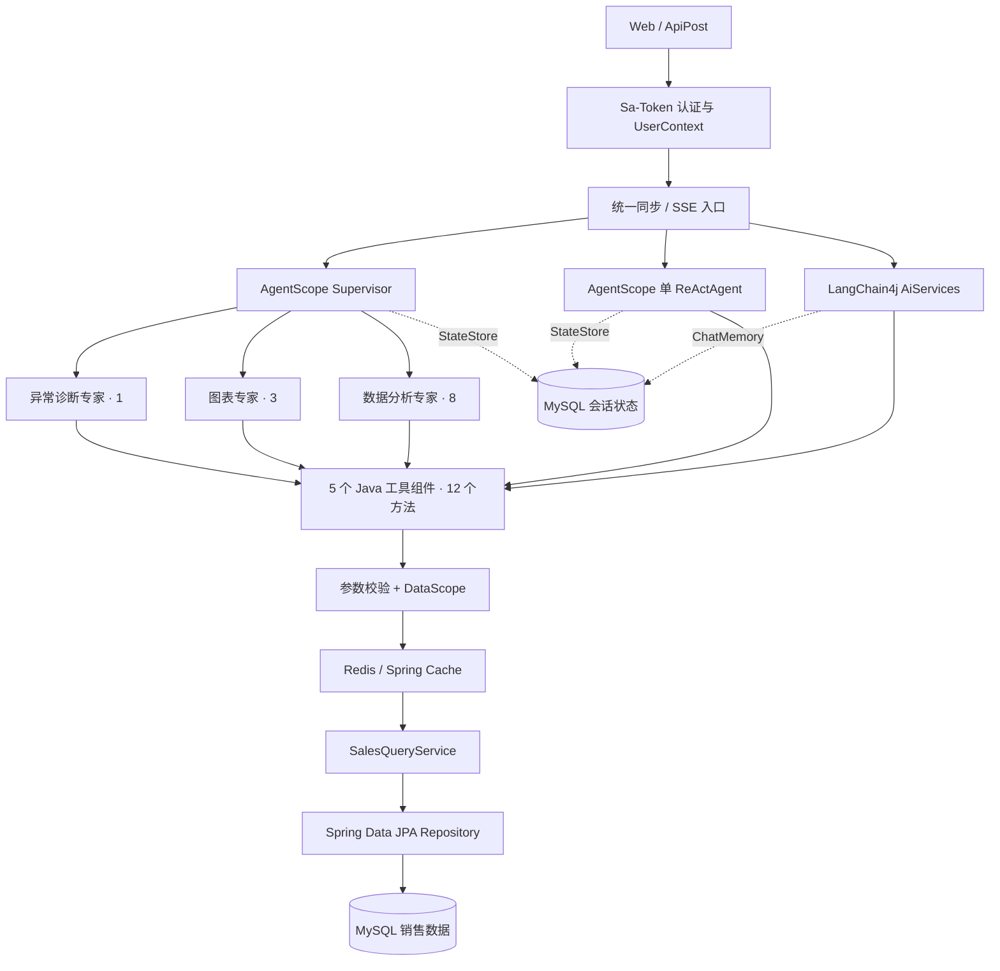

# 智能销售数据分析 Agent

面向销售团队的只读智能分析服务，解决固定报表入口分散、组合分析步骤长的问题。用户可以通过自然语言完成订单查询、销售汇总与排名、同比环比、月度趋势、ECharts 图表生成和销售异常检测。系统提供 LangChain4j AiServices、AgentScope 单 ReActAgent、Supervisor 多 Agent 三种执行模式；模型负责理解问题、选择工具或委派专家，Java 后端统一负责参数校验、数据权限、缓存和数据库查询。

## 核心能力

- **三种执行模式**：LangChain4j AiServices、AgentScope 单 ReActAgent、Supervisor 多 Agent 均可完成销售分析。
- **统一同步与 SSE 入口**：`/analysis` 根据配置或请求参数路由模式，并返回实际执行模式；主链路异常时按配置执行 fallback。
- **统一工具链**：5 个 Java 工具组件共提供 12 个只读工具方法，三种模式复用同一套校验、权限、缓存、Service 和 Repository。
- **专家任务委派**：Supervisor 调度数据分析、图表生成和异常诊断专家，专家工具范围分别为 8、3、1。
- **三级数据权限**：Sa-Token Session 恢复可信身份，`DataScope` 将角色映射为公司、大区或销售员范围，并落实到查询条件和缓存 Key。
- **会话持久化与隔离**：LangChain4j ChatMemory 与 AgentScope StateStore 均持久化到 MySQL，并按用户、客户端 `sessionId` 和执行模式隔离。
- **缓存与可观测性**：Redis 缓存销售汇总、排名和趋势结果；Micrometer 记录路由、AgentScope 生命周期阶段与 Token 指标，AgentScope 响应提供请求级执行摘要。

## 技术栈

| 分类 | 技术 |
|---|---|
| 开发语言 | Java 25 |
| Web 框架 | Spring Boot 3.5.11 |
| Agent 框架 | LangChain4j 1.12.1 / AgentScope Java 2.0.1 |
| 模型接口 | DashScope OpenAI 兼容接口 / DashScope 原生模型扩展 |
| 数据库 | MySQL 8 |
| ORM | Spring Data JPA / Hibernate |
| 缓存 | Redis / Spring Cache |
| 认证 | Sa-Token / BCrypt |
| 流式输出 | SSE / Reactor Flux |
| 观测 | Micrometer / Spring Boot Actuator |
| 构建工具 | Maven |

## 系统架构



三种模式共享确定性的业务查询链路。Supervisor 在同一应用内通过 SubAgent 工具委派任务：总控只持有三个专家委派入口，销售数据工具由职责明确的专家调用。

## 执行模式与统一入口

| 模式 | 实现 | 工具范围 | 会话状态 |
|---|---|---|---|
| `LANGCHAIN4J` | LangChain4j AiServices | 5 个组件中的 12 个方法 | MySQL ChatMemory |
| `AGENTSCOPE_SINGLE` | AgentScope ReActAgent | 12 个 AgentScope 工具 | MySQL AgentStateStore |
| `AGENTSCOPE_TEAM` | Supervisor + 3 类专家 | 专家分别使用 8、3、1 个工具 | MySQL AgentStateStore，使用 `team:` 会话命名空间 |

统一入口：

| 方法 | 地址 | 用途 |
|---|---|---|
| `POST` | `/analysis/chat` | 按配置或请求参数选择执行模式，返回回答、路由信息和 AgentScope 执行摘要 |
| `POST` | `/analysis/chat/stream` | 统一 SSE 问答，首个 `route` 事件给出实际路由 |
| `DELETE` | `/analysis/session/{sessionId}?mode=...` | 清理当前用户指定模式的会话 |

请求体中的 `mode` 可省略：

```json
{
  "sessionId": "routing-team-001",
  "message": "统计今年各大区销售额并生成柱状图",
  "mode": "AGENTSCOPE_TEAM"
}
```

路由配置位于 `sales-agent.routing`：

```yaml
sales-agent:
  routing:
    default-mode: AGENTSCOPE_TEAM
    fallback-enabled: true
    fallback-mode: LANGCHAIN4J
    allow-request-override: true
```

`allow-request-override=true` 时，请求中的 `mode` 优先；否则使用 `default-mode`。同步调用在主模式抛出异常后切换到 `fallback-mode`。SSE 调用仅在输出 `token` 或 `tool_start` 之前切换，确保一次响应只包含一条有效回答链路。同步响应的 `route` 字段包含请求模式、实际模式和 fallback 标记；SSE 通过 `route` 与 `fallback` 事件表达相同信息。

各执行模式同时提供专用入口：

| 方法 | 地址 | 用途 |
|---|---|---|
| `POST` | `/agent/chat` | LangChain4j 同步问答 |
| `POST` | `/agent/chat/stream` | LangChain4j SSE 问答 |
| `DELETE` | `/agent/session/{sessionId}` | 清理 LangChain4j 会话 |
| `POST` | `/agentscope/chat` | AgentScope 单 ReActAgent 同步问答 |
| `POST` | `/agentscope/chat/stream` | AgentScope 单 ReActAgent SSE 问答 |
| `DELETE` | `/agentscope/session/{sessionId}` | 清理单 ReActAgent 会话 |
| `POST` | `/agentscope/team/chat` | Supervisor 多 Agent 同步问答 |
| `POST` | `/agentscope/team/chat/stream` | Supervisor 多 Agent SSE 问答 |
| `DELETE` | `/agentscope/team/session/{sessionId}` | 清理 Supervisor 会话 |

## 工具设计

LangChain4j 直接注册 5 个 Java 工具组件；AgentScope 通过适配层复用相同实现，并向 Toolkit 暴露 12 个对应方法。

| Java 工具组件 | 方法 | 数量 | Supervisor 专家 |
|---|---|---:|---|
| `SalesQueryTool` | `queryOrders` | 1 | 数据分析 |
| `SalesSummaryTool` | `getTopReps`、`getRegionRanking`、`getTopProducts`、`getSalesSummary` | 4 | 数据分析 |
| `SalesTrendTool` | `calcMonthOverMonth`、`calcYearOverYear`、`getMonthlyTrend` | 3 | 数据分析 |
| `ChartGeneratorTool` | `generateLineChart`、`generateBarChart`、`generatePieChart` | 3 | 图表生成 |
| `AnomalyDetectionTool` | `detectAllAnomalies` | 1 | 异常诊断 |
| **合计** |  | **12** | **8 / 3 / 1** |

带输入参数的工具统一通过 `ToolInputValidator` 校验日期与日期范围、大区、返回数量、月份、图表维度和标题等参数。图表工具返回带 `CHART_JSON:` 前缀的 ECharts `option` JSON；异常工具按当前数据范围检测大区订单量骤降、产品连续零销售、销售员退单率异常和销售员业绩骤降。

## 身份、权限与会话

登录接口使用 BCrypt 校验密码，并由 Sa-Token 建立登录态。每次业务请求从 Sa-Token Session 读取 `userId`、角色、大区和销售员信息，写入请求线程的 `UserContext`；请求结束后清理上下文。LangChain4j 流式模型在异步回调边界恢复用户快照，AgentScope 则把用户与 `DataScope` 写入每次调用独立的 `RuntimeContext`。

| 角色 | DataScope | 查询范围 |
|---|---|---|
| `SALES_DIRECTOR` | `COMPANY:0` | 全公司 |
| `SALES_MANAGER` | `REGION:{regionId}` | 本大区 |
| `SALES_REP` | `REP:{repId}` | 本人 |

权限范围显式进入 Service、Repository 查询条件和 Redis Key。客户端指定大区或销售员筛选时，Service 会在 DataScope 上限内再次校验；Repository 查询始终携带 `scopeType` 与 `scopeId`。

会话隔离规则：

- LangChain4j 将客户端 `sessionId` 转换为 `{userId}:{sessionId}`，使用窗口大小为 20 的 `MessageWindowChatMemory`，消息存入 MySQL `sa_chat_memory`。
- AgentScope StateStore 分别保存 `userId` 与 `sessionId`；Supervisor 会话增加 `team:` 前缀，与同名的单 ReActAgent 会话隔离。
- 统一清理接口根据实际模式删除当前登录用户对应的会话状态。

## SSE 与执行观测

AgentScope SSE 映射以下事件：

| 事件 | 数据 |
|---|---|
| `agent_start` | Agent 回复标识 |
| `model_start` / `model_end` | 模型调用标识与 Token 使用量 |
| `token` | 文本片段 |
| `tool_start` / `tool_end` | 工具名称与执行状态 |
| `summary` | 请求级执行摘要 |
| `done` | `[DONE]` |
| `error` | 安全错误信息 |

统一 SSE 入口在业务事件前增加 `route`，发生模式切换时增加 `fallback`。LangChain4j 专用 SSE 入口输出 `token`、`done` 和 `error`；通过统一入口调用 LangChain4j 时还会映射 `tool_start` 与 `tool_end`。

AgentScope Middleware 覆盖 Agent、reasoning、model、tool 四层，记录阶段完成状态与耗时，并汇总模型、工具、专家调用和 Token 用量。同步响应的 `execution` 字段和 SSE 的 `summary` 事件包含：

- `requestId`、根 Agent、状态、总耗时；
- 专家调用次数与专家名称；
- 推理轮次、模型调用次数、工具调用次数与工具名称；
- 输入、输出与缓存 Token 数量。

Actuator 暴露的核心指标包括 `agentscope.*`、`sales.agent.routing.*` 和 `llm.tokens.*`。执行摘要只保存结构化执行信息。

## 项目结构

```text
src/main/java/com/dyh/salesAgent
├─ agent
│  ├─ agentscope    ReActAgent、Supervisor、专家、工具适配、StateStore 与 Middleware
│  └─ routing       三种执行模式的统一路由与 fallback
├─ config           Web、Redis、密码编码和指标配置
├─ controller       登录、统一入口、各模式专用入口和工具测试接口
├─ dto              查询结果与异常结果 DTO
├─ entity           JPA 实体
├─ memory           LangChain4j MySQL ChatMemory
├─ repository       数据库查询与 DataScope 条件
├─ security         UserContext、DataScope、参数校验和流式上下文
├─ service          查询服务与缓存服务
└─ tool             5 个 Java 工具组件
```

## 环境要求

- JDK 25
- Maven 3.9+
- MySQL 8
- Redis 7
- DashScope API Key

## 配置

凭据通过环境变量注入：

| 环境变量 | 说明 | 默认值 |
|---|---|---|
| `MYSQL_HOST` | MySQL 地址 | `localhost` |
| `MYSQL_PORT` | MySQL 端口 | `3306` |
| `MYSQL_DATABASE` | 数据库名称 | `sales_analysis_agent` |
| `MYSQL_USERNAME` | MySQL 用户名 | 必填 |
| `MYSQL_PASSWORD` | MySQL 密码 | 必填 |
| `REDIS_HOST` | Redis 地址 | `localhost` |
| `REDIS_PORT` | Redis 端口 | `6379` |
| `REDIS_PASSWORD` | Redis 密码 | 必填 |
| `DASHSCOPE_API_KEY` | LangChain4j 与 AgentScope 共用的模型凭据 | 必填 |

PowerShell 示例：

```powershell
$env:MYSQL_USERNAME="YOUR_MYSQL_USERNAME"
$env:MYSQL_PASSWORD="YOUR_MYSQL_PASSWORD"
$env:REDIS_PASSWORD="YOUR_REDIS_PASSWORD"
$env:DASHSCOPE_API_KEY="YOUR_DASHSCOPE_API_KEY"
```

Agent、工具、路由和认证参数集中在 `src/main/resources/application.yml` 的 `sales-agent`、`langchain4j`、`sa-token` 与 `app.auth` 配置段。

## 本地启动

1. 创建数据库：

```sql
CREATE DATABASE sales_analysis_agent
    DEFAULT CHARACTER SET utf8mb4
    COLLATE utf8mb4_unicode_ci;

CREATE DATABASE agentscope
    DEFAULT CHARACTER SET utf8mb4
    COLLATE utf8mb4_unicode_ci;
```

本地数据库账号需具备这两个数据库的表结构初始化权限。

2. 启动 MySQL 和 Redis，并设置环境变量。

3. 构建并启动：

```bash
mvn clean package -DskipTests
mvn spring-boot:run
```

项目启动时执行 `db/schema.sql` 与 `db/data.sql`，在 `sales_analysis_agent` 中创建销售业务表、LangChain4j 会话表和本地测试数据；AgentScope StateStore 根据配置在 `agentscope` 中初始化自身表结构。

`data.sql` 初始化的销售账号统一使用本地测试口令 `LocalSales@2026`。该固定口令仅用于本地初始化数据，登录时传入原始口令，数据库中保存的是 BCrypt 摘要。

4. 查看健康状态：

```text
GET http://localhost:8087/actuator/health
```

## 测试

不依赖外部服务的会话隔离测试：

```bash
mvn "-Dtest=UserScopedMemoryIdTest,UserScopedControllerMemoryTest" test
```

MySQL、Redis 与 DashScope 配置就绪后运行完整测试：

```bash
mvn test
```

## 快速调用

登录获取 Token：

```bash
curl --location 'http://localhost:8087/auth/login' \
  --header 'Content-Type: application/json' \
  --data '{
    "loginName": "sales_director",
    "password": "LocalSales@2026"
  }'
```

调用统一同步入口：

```bash
curl --location 'http://localhost:8087/analysis/chat' \
  --header 'Authorization: YOUR_TOKEN' \
  --header 'Content-Type: application/json' \
  --data '{
    "sessionId": "routing-team-001",
    "message": "统计近6个月销售趋势并分析异常",
    "mode": "AGENTSCOPE_TEAM"
  }'
```

调用统一 SSE 入口：

```bash
curl --no-buffer --location 'http://localhost:8087/analysis/chat/stream' \
  --header 'Authorization: YOUR_TOKEN' \
  --header 'Accept: text/event-stream' \
  --header 'Content-Type: application/json' \
  --data '{
    "sessionId": "routing-stream-001",
    "message": "生成近6个月销售趋势折线图",
    "mode": "AGENTSCOPE_SINGLE"
  }'
```

完整的登录、权限、参数校验、缓存、三种模式与 SSE 测试步骤见 [ApiPost 接口测试文档](docs/ApiPost接口测试.md)。

## 运行截图

### 登录成功


### 同步问答


### SSE 流式回答


### Redis 缓存命中


